# Cognitive Services meets Power Apps Hackathon

This tutorial will guide you through two scenario's:

- [Forms Processing](#scenario-1-form-processing-with-power-apps): This is a step-by-step guide through the process of building a Power App infused by AI to familiarize yourself with Power Apps

- [Object Classification](#scenario-2-object-classification-with-the-custom-vision-api): This tutorial will show you how to deploy resources in Azure, train your own Custom Vision model and integrate it in any application

## Cognitive Services

Cognitive Services provides machine learning capabilities to solve general problems such as analyzing text for emotional sentiment or analyzing images to recognize objects or faces. You don't need special machine learning or data science knowledge to use these services.
Azure Cognitive Services are APIs, SDKs, and services available to help developers build intelligent applications. Azure Cognitive Services enable developers to easily add cognitive features into their applications. The goal of Azure Cognitive Services is to help developers create applications that can see, hear, speak, understand, and even begin to reason. The catalog of services within Azure Cognitive Services can be categorized into five main pillars - Vision, Speech, Language, Web Search, and Decision.
(For detailed documentation see [here](https://docs.microsoft.com/en-us/azure/cognitive-services/welcome))

## Power Apps

Power Apps is a suite of apps, services, connectors and data platform that provides a rapid application development environment to build custom apps for your business needs. Using Power Apps, you can quickly build custom business apps that connect to your business data stored either in the underlying data platform (Common Data Service) or in various online and on-premises data sources (SharePoint, Excel, Office 365, Dynamics 365, SQL Server, and so on).

Apps built using Power Apps provide rich business logic and workflow capabilities to transform your manual business processes to digital, automated processes. Further, apps built using Power Apps have a responsive design, and can run seamlessly in browser or on mobile devices (phone or tablet). Power Apps "democratizes" the custom business app building experience by enabling users to build feature-rich, custom business apps without writing code.

Power Apps also provides an extensible platform that lets pro developers programmatically interact with data and metadata, apply business logic, create custom connectors, and integrate with external data.
(For detailed documentation see [here](https://docs.microsoft.com/en-us/powerapps/powerapps-overview))

## Scenario 1: Form Processing with Power Apps

The focus of this lab is to familiarize yourself with PowerApps. Within PowerApps you have the ability to include Cognitive Services capabilities with the help of the AI Builder without having to worry about Azure access,deploying resources and so on.

The scenario we are looking at is Form Processing.
Form processing identifies the structure of your documents based on examples you provide to extract text from any matching form. Examples might include tax forms or invoices.

In this lab we will build and train a model for recognizing invoices. Then we will build a tablet app to show the detection in action and digitize the content.

Navigate to the [Power Apps Homepage](https://powerapps.microsoft.com/en-us/) and sign in with the credentials we have provided.

Once you've signed in click on "AI Builder" then "Build" on the left hand side.
Since this is your first time using Power Apps you'll have to create a new environment & add a database first - click on the corresponding button in the middle of the page and just follow the instructions.

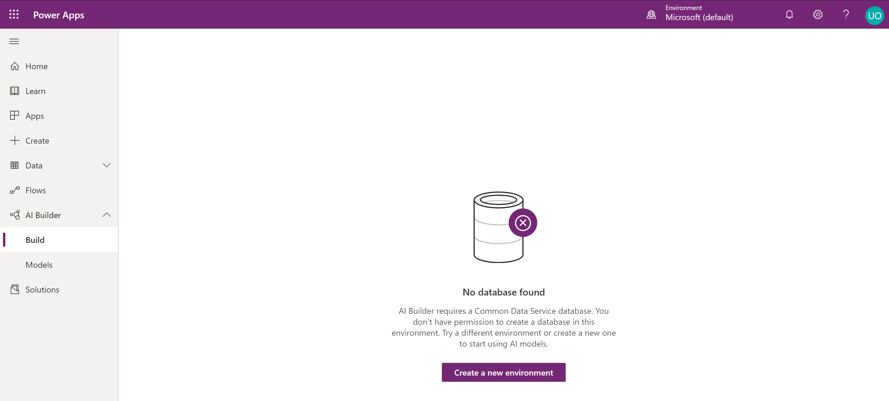

Once that is done, you should see this view in the AI Builder - Build Tab:

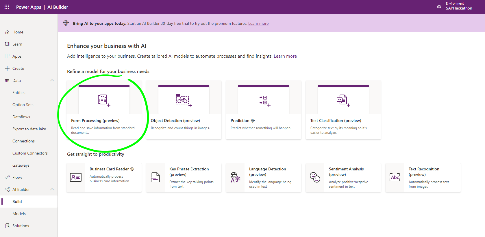

Click on Form Processing, choose a name for your AI model and hit the Create button.
Your screen should look like the following image:

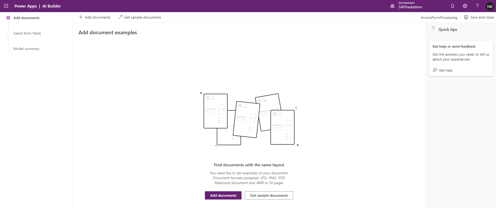

We have prepared some sample invoices for you. You can find these documents [here](../Instructions/Annex/FormProcessing_Invoices.zip). Select Add documents and add the documents from the Train folder.
You must have at least five documents to train the model.
Confirm the selection and click Upload.

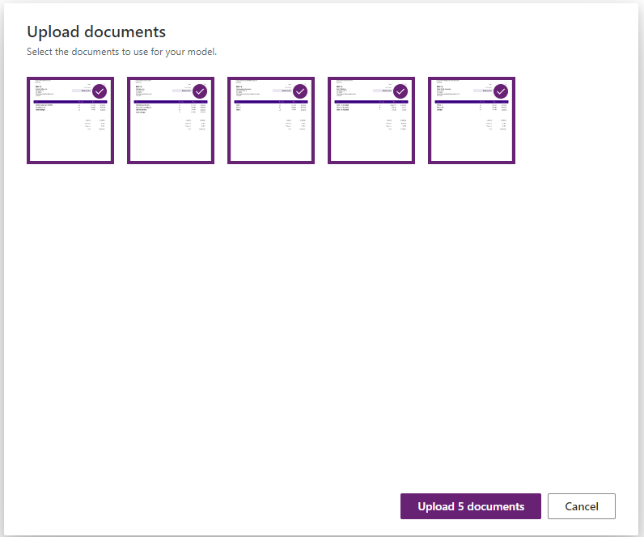

Once your uploads are complete, select Analyze:

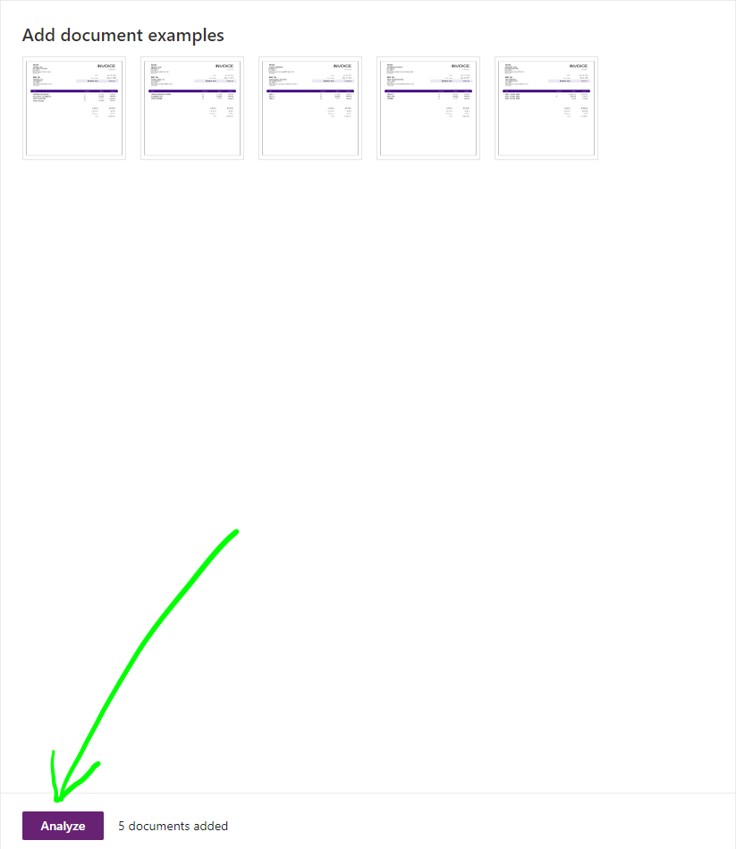

Select the fields:  

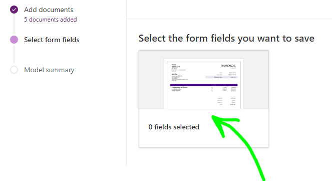

Hover over the highlighted fields and confirm the fields that should be returned by the form when processing from our trained model.

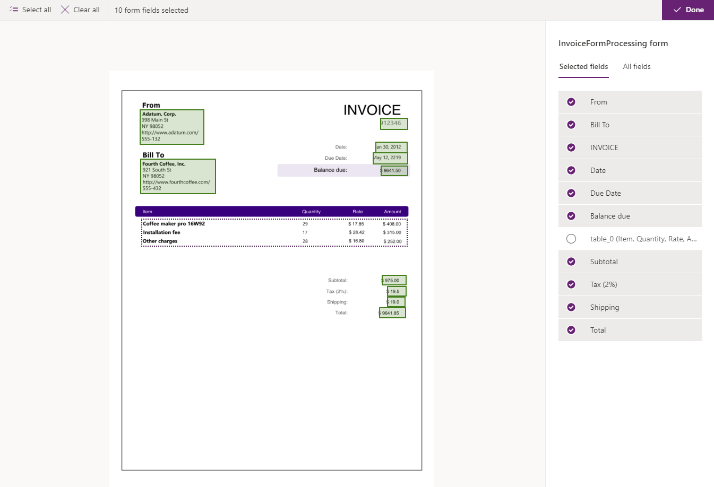

Once you have confirmed the fields, click Done.
Then click next to get to the Model summary page. Here click on Train to start model training.
You'll be prompted to Go to the Details page once the training is completed.

If you click on Quick test you can upload an image from the test folder to perform a test of your model.

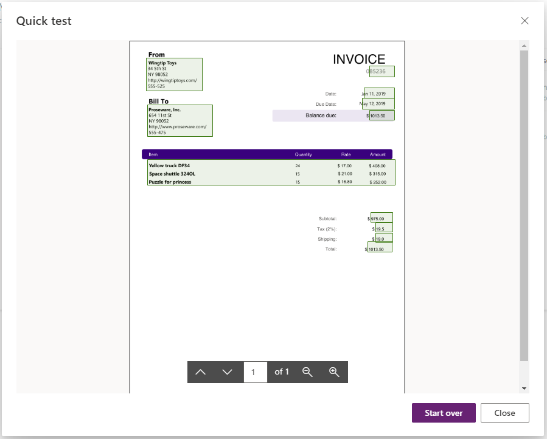

You can also perform a test with another image if you like.
Once you're satisfied with the result click on Publish to publish your model.

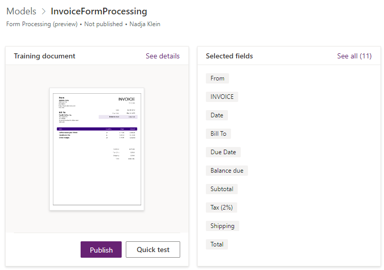

Now that we've published the model it's time to implement it into a Power App. Therefore navigate to Apps on the left hand side and create a new Canvas App. Select Blank app with a tablet layout.

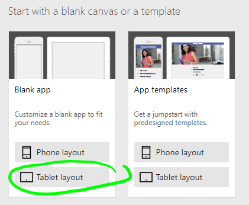

Insert the Form Processor control from the AI Builder.

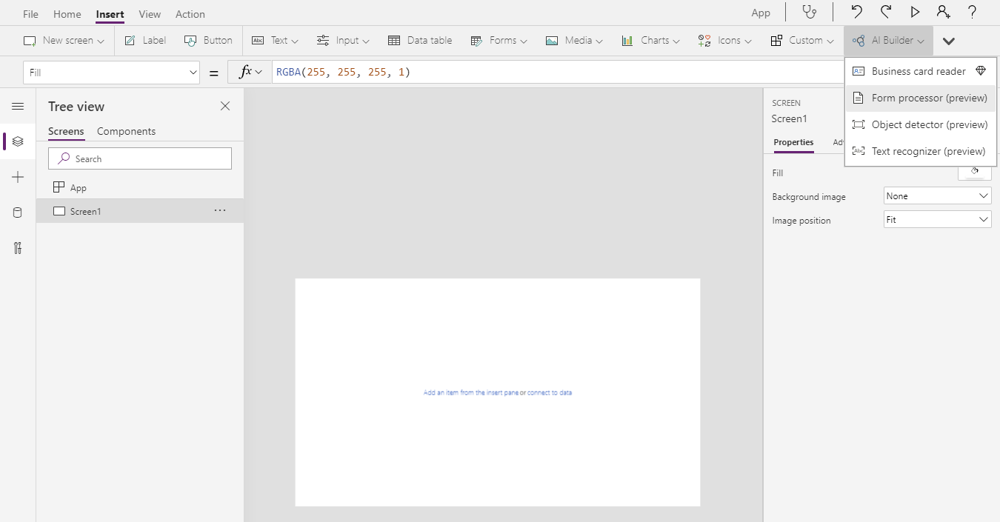

Map it to your saved model.

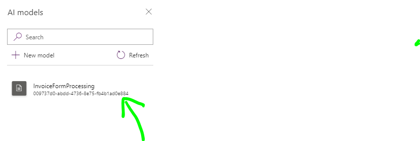

Drag and resize the control like the image below, then play your app.

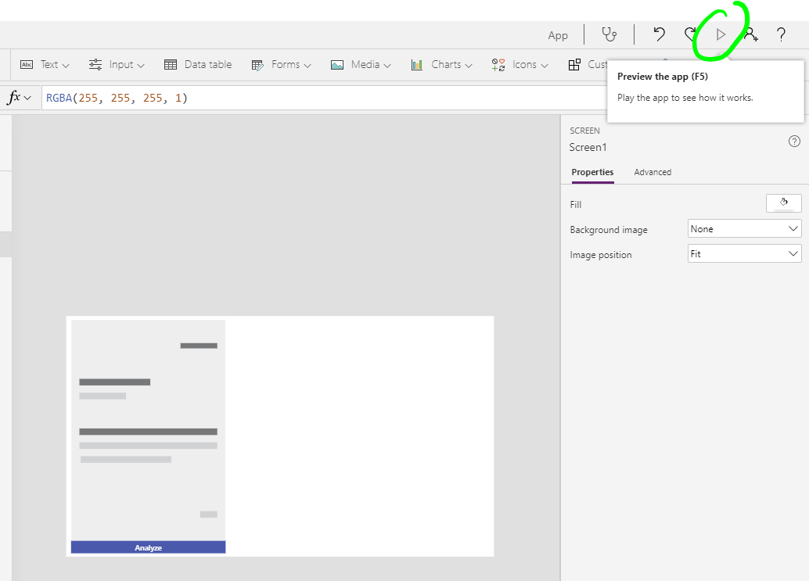

Click Analyze and add your test file. Your uploaded form will be analyzed and you can see the mapped fields are recognized. Close the app player.

Let's take some of the data fields and place them on the screen for the user to review.
Add three labels to the screen. Drag them to the right side of the screen and line them up like in the image below. Edit the text to "Invoice Number", "Due Date" and "Total".

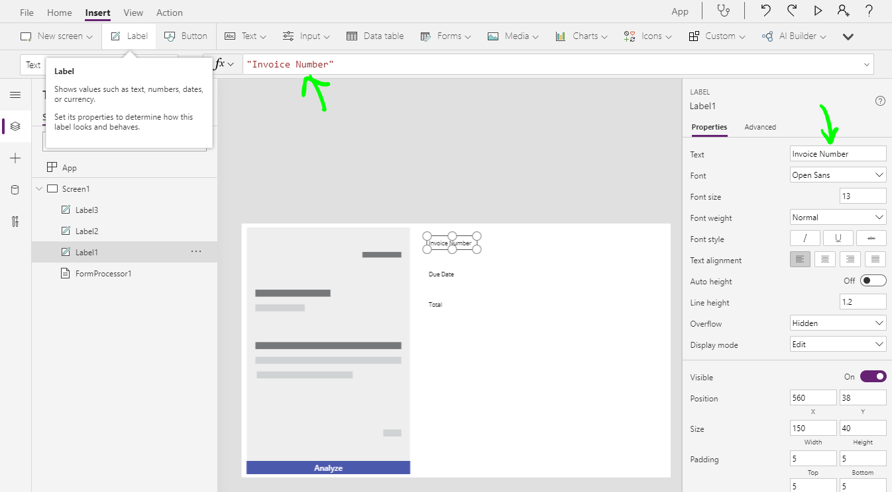

Add Text input fields for each row and place them next to the labels.
Now we will map data from the analyzed document. Edit the default values for each field as follows:

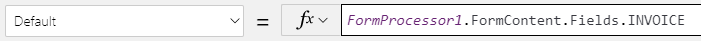
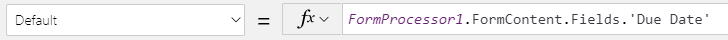
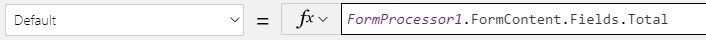

Play the app and add an invoice to be analyzed.
You can of course add additional fields as well, please feel free to play around with different options.

## Scenario 2: Object Classification with the Custom Vision API

In the previous example you have seen how to infuse your app with AI thanks to the AI Builder. However, you are currently limited in the modules that you can choose.
Therefore we will now look at how you can deploy Cognitive Services for yourself and how you're able to train your own model and use it in any environment that you'd like.

For this scenario we will use Custom Vision to classify an uploaded image. Custom Vision is a cognitive service that lets you build, deploy, and improve your own image classifiers. An image classifier is an AI service that applies labels (which represent classes) to images, according to their visual characteristics. Unlike the Computer Vision service, Custom Vision allows you to determine the labels to apply.

So, how does it work?

The Custom Vision service uses a machine learning algorithm to apply labels to images. You, the developer, must submit groups of images that feature and lack the characteristics in question. You label the images yourself at the time of submission. Then the algorithm trains to this data and calculates its own accuracy by testing itself on those same images. Once the algorithm is trained, you can test, retrain, and eventually use it to classify new images according to the needs of your app. You can also export the model itself for offline use.

#### Create Custom Vision resources in the Azure portal

First of all lets navigate to the [Azure Portal](https://portal.azure.com/). Sign in with the username and password that you have received - or with your own credentials in case you already have an Azure account.

Once you're logged in click on Create a resource on the left hand side and then search for Custom Vision.

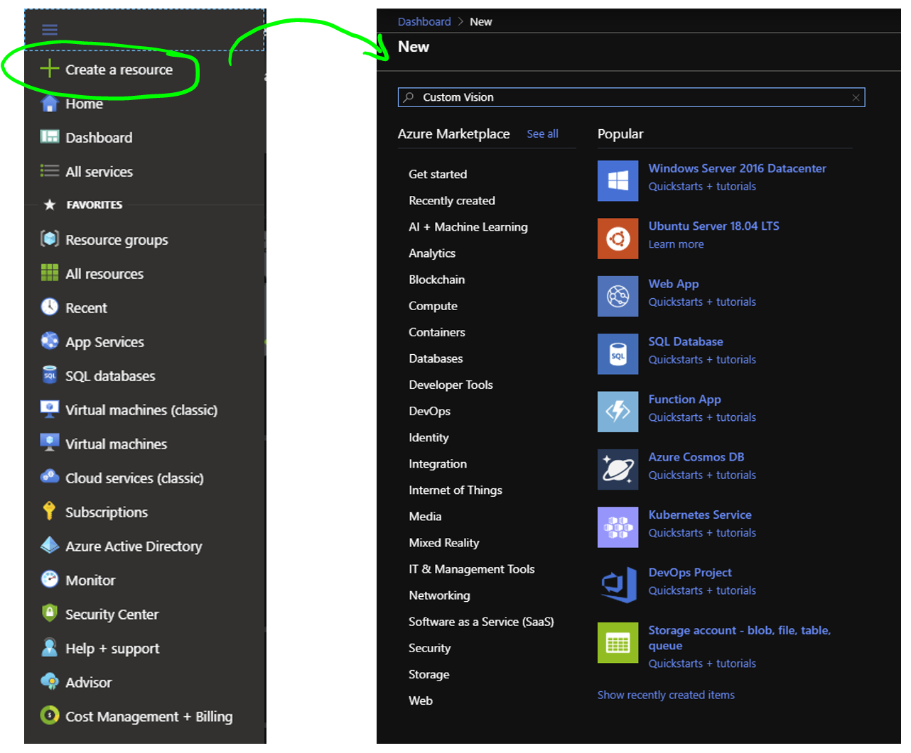

(if you click on AI + Machine Learning you can have a look at all available Cognitive Services API's)

Whenever you create a new resource it always gives you a list of helpful links like documentation, tutorials, pricing etc.
Click on Create and fill out the necessary fields:

- Name: Choose a name for your resource
- Subscription: Choose the trial or your own subscription
- Resource Group: Click Create New and choose a name
- Location: We recommend the location that is closest to your location
- Pricing: F0 is sufficient for the tutorial - you can change it later if necessary

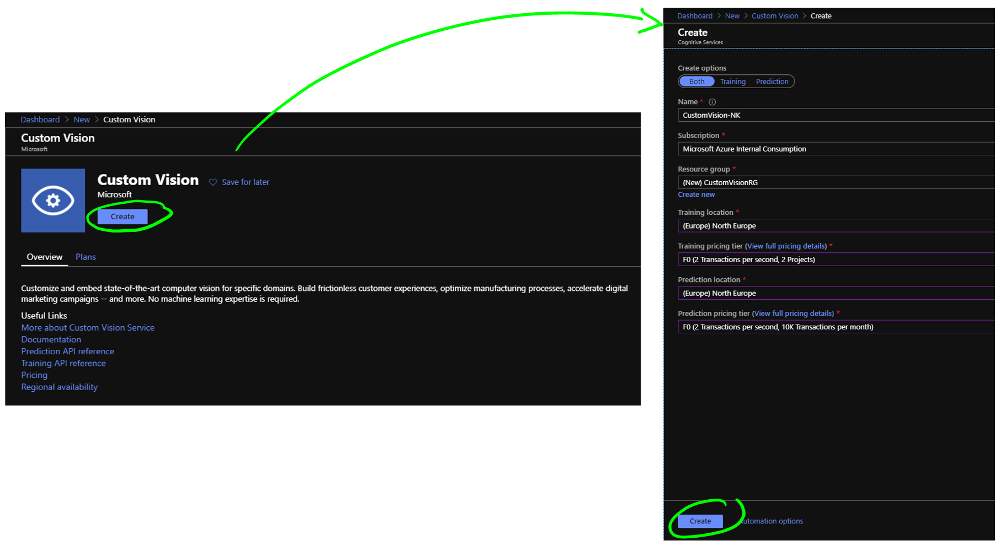

After you hit Create your Custom Vision resource is being deployed. You'll be notified once it is done. By clicking on Go to Resource you'll be directed to the Quickstart page of your resource. This is your Training resource. If you have a look at the resource group you will also find a Prediction resource. Navigate there and go to the Quick start Tab.
Take note of your Key and Endpoint as we will need it at a later point to connect to the service.

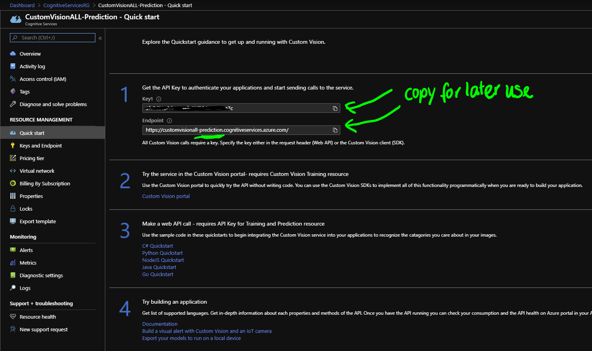

#### Create a new project

Now it's time to train your own model. Navigate to the [Custom Vision Portal](https://www.customvision.ai/) and sign in with the same account you used to sign into the Azure portal.

On the start page create a new project.

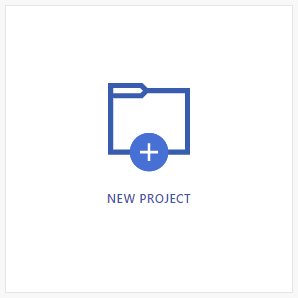

The Create new project dialog box will appear.
Enter a name and a description for the project. Then select a Resource Group. If your signed-in account is associated with an Azure account, the Resource Group dropdown will display all of your Azure Resource Groups that include a Custom Vision Service Resource.

Custom Vision functionality can be divided into two features. Image classification applies one or more labels to an image. Object detection is similar, but it also returns the coordinates in the image where the applied label(s) can be found.
Multilabel classification applies any number of your tags to an image (zero or more), while multiclass classification sorts images into single categories (every image you submit will be sorted into the most likely tag). You'll be able to change the classification type later if you want to.

For this example select Image classification. Then choose Multiclass.

Next, select one of the available domains. Each domain optimizes the classifier for specific types of images. We'll choose Food, which is optimized for photographs of dishes as you would see them on a restaurant menu e.g. if you want to classify photographs of individual fruits or vegetables, use this. If your project doesn't fit into one of the categories, you can alway go with General. You are also able to change it at any time.

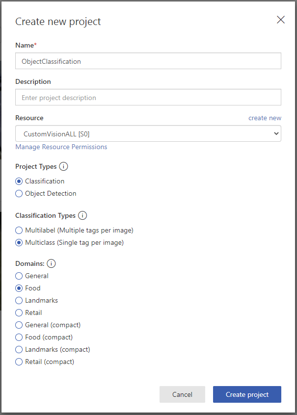

After you click Create project, you should see the following screen:

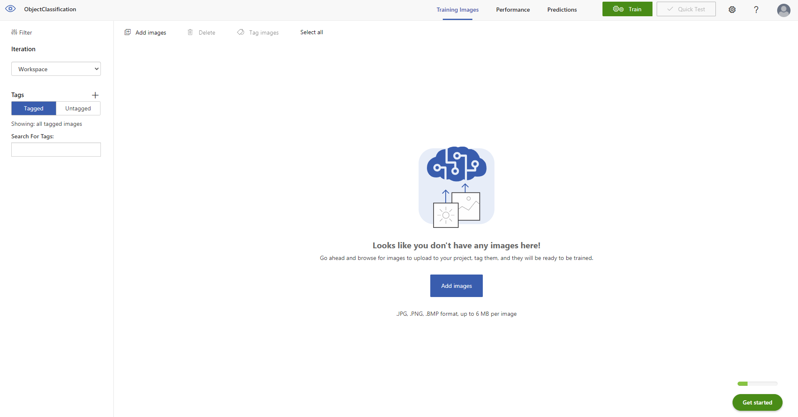

#### Upload and tag images

Before you continue, download the sample data [here](../Instructions/Annex/CustomVision_Images.zip).

To add images, click the Add images button and then select Browse local files. Select Open to move to tagging. Your tag selection will be applied to the entire group of images you've selected to upload, so it's easier to upload images in separate groups according to their desired tags. You can also change the tags for individual images after they have been uploaded.

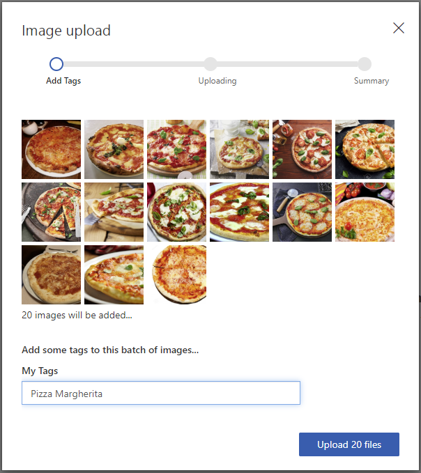

To create a tag, enter text in the My Tags field and press Enter. If the tag already exists, it will appear in a dropdown menu. In a multilabel project, you can add more than one tag to your images, but in a multiclass project you can add only one. To finish uploading the images, use the Upload [number] files button.
Select Done once the images have been uploaded.
Repeat this step for Pizza Regina and Pizza Salami. Then you should have 20 images per tag.

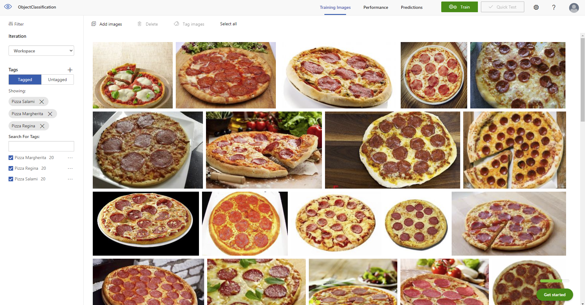

#### Train the classifier

To train the classifier, select the Train button. The classifier uses all of the current images to create a model that identifies the visual qualities of each tag.

Training Type Quick Training is sufficient for this tutorial. Choose Advanced Training for improved performance, escpecially on challenging and fine-grained datasets.
The training process should only take a few minutes. During this time, information about the training process is displayed in the Performance tab.

#### Evaluate the classifier

After training has completed, the model's performance is estimated and displayed. The Custom Vision Service uses the images that you submitted for training to calculate precision and recall, using a process called k-fold cross validation. Precision and recall are two different measurements of the effectiveness of a classifier:

- Precision indicates the fraction of identified classifications that were correct. For example, if the model identified 100 images as dogs, and 99 of them were actually of dogs, then the precision would be 99%.
- Recall indicates the fraction of actual classifications that were correctly identified. For example, if there were actually 100 images of apples, and the model identified 80 as apples, the recall would be 80%.

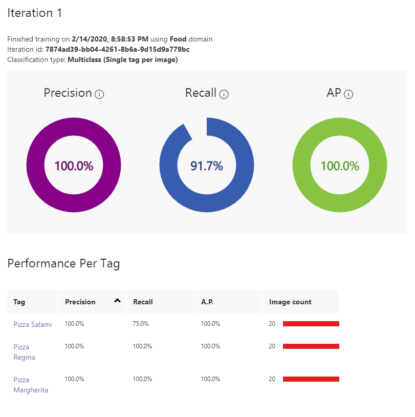

Note the Probability Threshold slider on the left pane of the Performance tab. This is the level of confidence that a prediction needs to have in order to be considered correct (for the purposes of calculating precision and recall).

When you interpret prediction calls with a high probability threshold, they tend to return results with high precision at the expense of recall - the detected classifications are correct, but many remain undetected. A low probability threshold does the opposite - most of the actual classifications are detected, but there are more false positives within that set. With this in mind, you should set the probability threshold according to the specific needs of your project. Later, when you're receiving prediction results on the client side, you should use the same probability threshold value as you used here.

#### Publish your model

When you are satisfied with the performance of the current training iteration, click Publish.
The Publish Model dialog opens where you can specify the Model name and the Prediction resource that you have deployed in the very beginning.

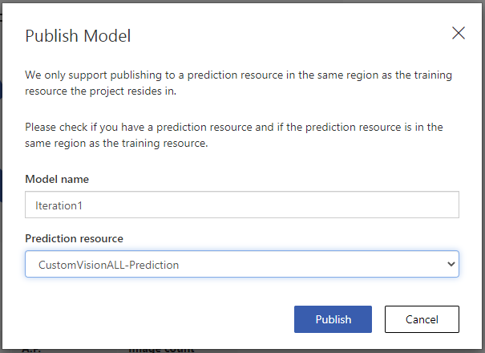

Take note of the Iteration Details like Iteration ID and the Publish Name, as we will need those later.

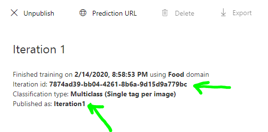

Now navigate to the settings tab and copy the Project ID which we will also need later on.

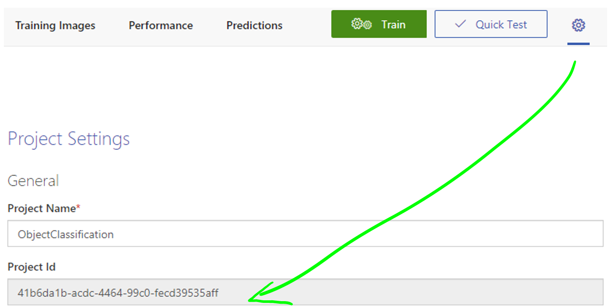

#### Create a Power App

Navigate to the [Power Apps Homepage](https://powerapps.microsoft.com/en-us/) and sign in with the credentials we have provided.

On the Apps Tab click New App and then Canvas. This time select Blank app with Phone layout:

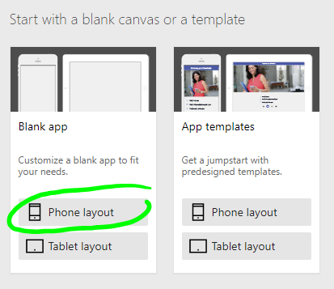

On the left hand side click on Data sources. There you'll find all available connectors. A connector is a proxy or a wrapper around an API that allows the underlying service to talk to Microsoft Power Automate, Microsoft Power Apps, and Azure Logic Apps. It provides a way for users to connect their accounts and leverage a set of pre-built actions and triggers to build their apps and workflows.

Our large ecosystem of software as a service (SaaS) connectors enable you to connect apps, data, and devices in the cloud. Examples of popular connectors include Salesforce, Office 365, Twitter, Dropbox, Google services, and more.

Search for the Custom Vision Connector. When you click the connect to data dialog appears. There you need to enter the Prediction Key and the Endpoint URL that you have copied from the Azure Portal in the very beginning - if not you can go [back to the portal](#create-custom-vision-resources-in-the-azure-portal) now and copy the keys ;-)

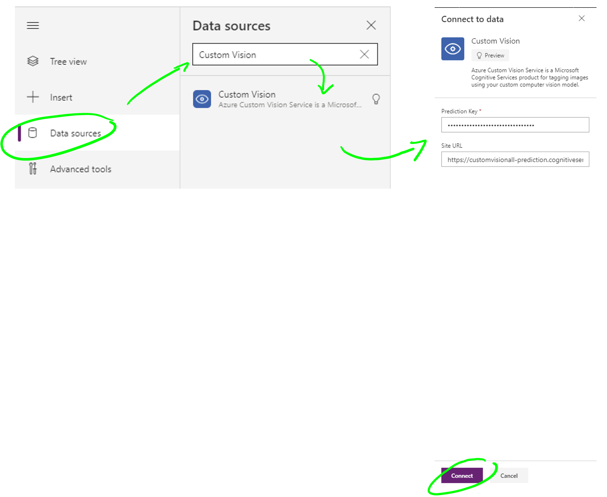

Before we continue save the app via the File ribbon:

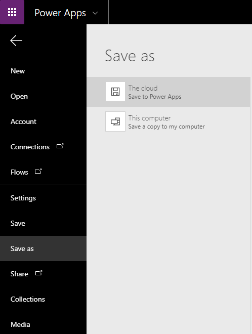

Go back to the Insert ribbon, click on Media and add picture. There are a lot of other options like Camera, Barcode scanner, Audio or Video input which might be interesting for other scenarios.

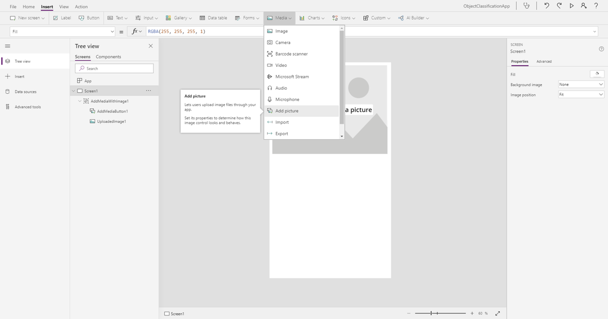

Resize the object to fit to the phone screen.
Now let's add a button:

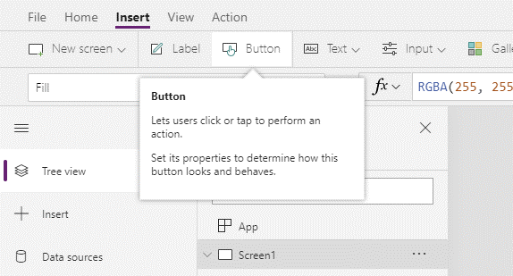

Adjust the size of the button and change the Text if you like. We will use this to trigger the API call to our pretrained model. Therefore we also need to adjust the formula "OnSelect" as shown in the picture:

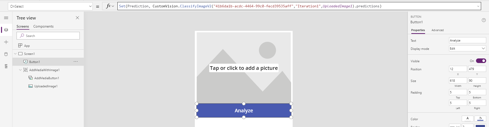

You should have noted your Project ID and Publish Name earlier, but you can always [go back](#publish-your-model) and get it.

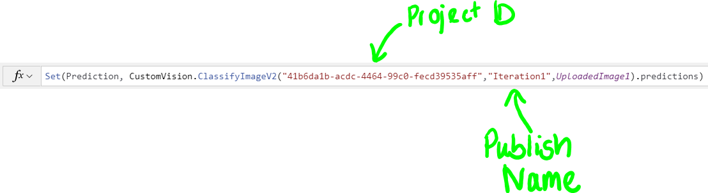

On the Insert ribbon click on Gallery and add a Blank Vertical Gallery. Drag it underneath the Analyze Button.

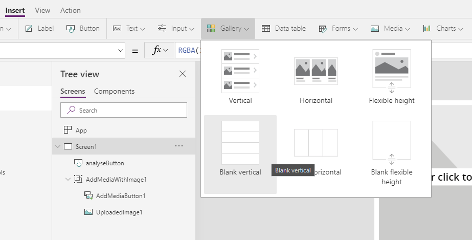

In the Formula bar change the Items formula to Prediction.

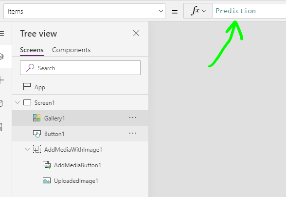

Click on the Edit icon within the gallery, then add two Text input fields.

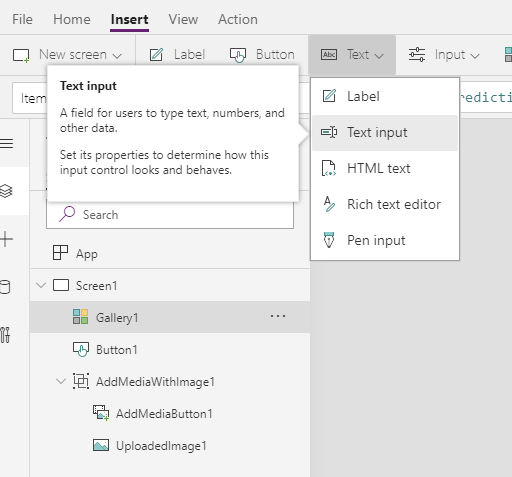

Feel free to rename and format the objects e.g. rename the text inputs to TagProbability and TagName and remove the text within and replace it with a less dominant Hint text.

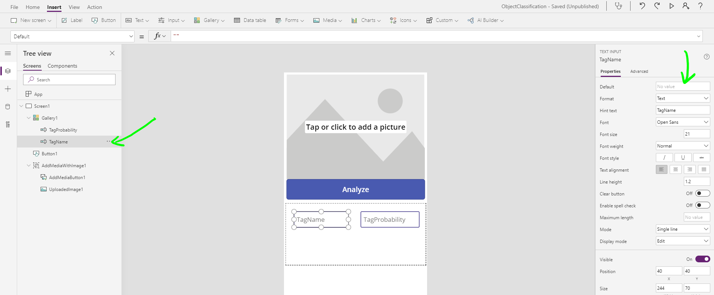

Now change the Default formula for both text inputs according to the image below:

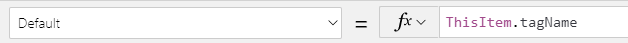
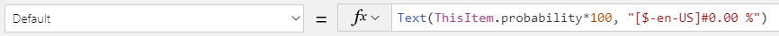

It is also possible to add logos, change the background etc. feel free to test things out.
If you would like to add an image or logo, you have to upload it via File - Media and then add an Image via the Media tab. You can then reference your uploaded image in the formula bar.

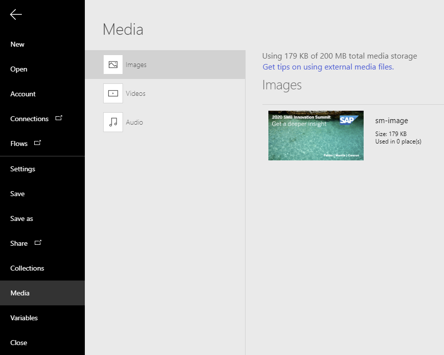

Let's do a quick test and see the results!

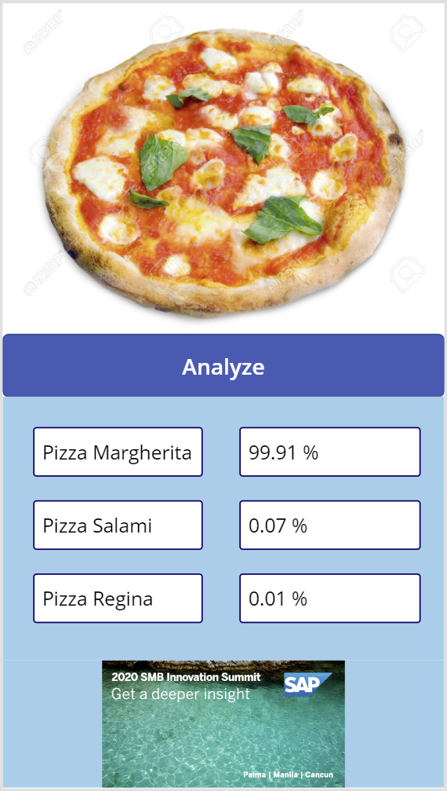

## Now what?

This is the end of our guided tutorials which were supposed to give you an idea about what you can do with Cognitive Services & Power Apps in the area of Vision.

Now it's your turn to get creative and start hacking!
