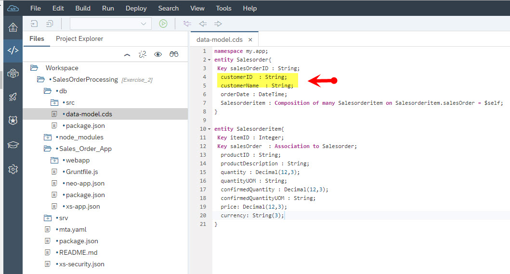
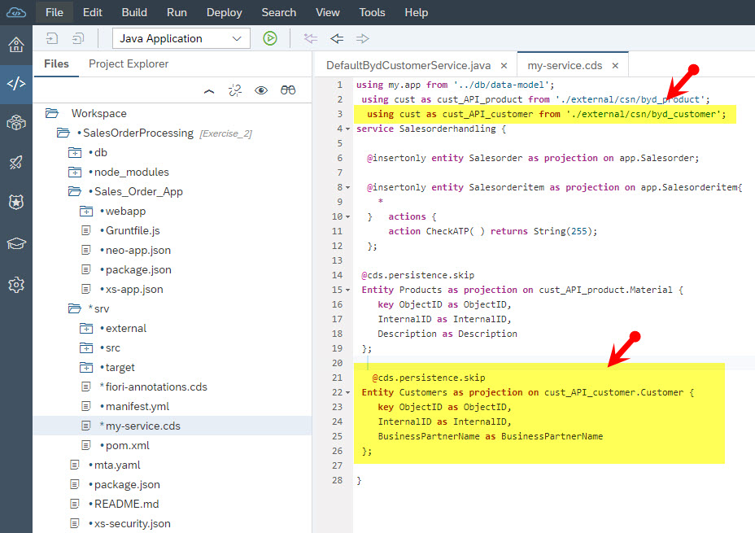

# SAP Business ByDesign Side-by-Side Extensions on SAP Cloud Platform
Detailed information regarding the SAP Business ByDesign side-by-side Extension on SAP Cloud Platform using 
SAP Cloud Application Programming Model (CAP) can be found in the blog post series
[SAP Business ByDesign Side-by-Side Extensions on SAP Cloud Platform](https://blogs.sap.com/2019/02/03/sap-business-bydesign-side-by-side-extensions/?preview_id=774314).

## Description 
The repository contains a step-by-step tutorial that assists you to build your first SAP Business ByDesign side-by-side extension application on SAP Cloud Platform Cloud Foundry environment using SAP Cloud Application Programming Model.
## Scenario
Our goal is to develop a simple sales order processing application. The sales order processing application shall enable the end-user to create, read, update and delete sales order instances out of Fiori UIs. More over the end-user will have the possibility to execute product availability check out of the UI. The execution of product availability check will lead to the population of the confirmed quantity with a random value between 0 and the requested quantity. 
The sales order processing application will enable the end-user to create sales order instances for products that are read from SAP Business ByDesign tenant using OData APIs.

## Requirements 

 - SAP SMB Summit 2019 will provide you with SAP Business ByDesign tenant required for developing the extension application 'Sales Order Processing' .
 - The extension application will be deployed in SAP Cloud Platform Cloud Foundry environment. Therefore, you will need SAP Cloud Platform Cloud Foundry subaccount. Additionally, a NEO subaccount is required to run SAP Web IDE. A trial SAP Cloud Platform account with Cloud Foundry and NEO subaccounts is sufficient for the implementation of this extension. If you don't have SAP Cloud Platform trial account, the first step of the exercise will guide you on how to acquire SAP Cloud Platform trial account.
 - We will use SAP Cloud Platform Web IDE Full-Stack as development
   environment.  Detailed Information on how to setup the development
   environment will be given in the first step of the exercise.
## Exercises
The SAP Business ByDesign side-by-side extension on SAP Cloud Platform tutorial consists of two exercises. The first exercise is the main exercise and will cover the development of persistence layer, service layer and UI layer. The second exercise is a bonus exercise, that you can try out if you have time left after completing the first exercise. Alternatively, you can also clone the master branch of this repository and carry out exercise 2.
###  Exercise 1
#### Step 1: System Set up
Follow the instructions in the following blog post to set up a development and deployment environment for the SAP usiness ByDesign side-by-side extension application.

[SAP Business ByDesign Side-by-Side Extensions on SAP Cloud Platform: System Set up](https://blogs.sap.com/?p=774387&preview=true&preview_id=774387)
#### Step 2: Configuring Connectivity Between SAP CP and SAP usiness ByDesign with Basic Authentication
The following blog post will guide you on how to set up a connectivity between your SAP usiness ByDesign tenant and SAP Cloud Platform Cloud Foundry subaccount using basic authentication. This connectivity is required to perform read or write operations on SAP usiness ByDesign tenant out of SAP CP Cloud Foundry environment.

[SAP Business ByDesign Side-by-Side Extensions on SAP Cloud Platform:    Configuring Connectivity Between SAP CP and SAP ByD with Basic    Authentication](https://blogs.sap.com/?p=774413&preview=true&preview_id=774413)

#### Step 3: Development and Deployment of the extension application 
The following blog post will walk you through the important steps required to develop a fully functional SAP usiness ByDesign extension application in SAP Cloud Platform Cloud Foundry environment. This simple SAP usiness ByDesign extension application will consist of persistence layer, service layer and UI layer. Moreover, it will utilize SAP Business ByDesign OData APIs to read data from SAP usiness ByDesign tenant.

[SAP Business ByDesign Side-by-Side Extensions on SAP Cloud Platform: Developing Extension Application](https://blogs.sap.com/?p=775227&preview=true&preview_id=775227)
### Exercise 2
In this exercise we will enhance the Sales Order Processing Application in such a way that business partner data from SAP Business ByDesign can be used as customer during sales order entry. That is. the value help of the customer related field will trigger the reading of business partner (customer) data from SAP Business ByDesign tenant using OData API.
#### Prerequisite 
Exercise 1 is a prerequisite for exercise 2. Therefore, to start with exercise 2 you have to complete exercise 1 or clone the final state of exercise 1 from the [master branch](https://github.wdf.sap.corp/D034669/SAP-Business-ByDesign-Side-by-Side-Extensions-on-SAP-Cloud-Platform) of this repository. 
#### Step 1:  Enhance the data model
1.  Go to the file WorkSpace/SalesOrderProcessing/db/data-model.cds and double click the file.
2. Adjust the content of the file data.model.cds  as shown in the screen shot below. That is, for the entity Salesorder replace the element customer with customerID and add a new element customerName.

#### Step 2: Add Remote Service
In this step we will add a customer data remote service (SAP usiness ByDesign Customer OData API) to the Sales Order Processing application.

 1. Right click on WorkSpace/SalesOrderProcessing/srv and select New → Data Model from External Service.

 2. On the ‘Data Connection’ screen select under ‘Sources’ the entry ‘Service URL’ and click on ‘create new data sources’

 -  On the following screen populate the fields as specified below and click Create.

 -  Next, enter the relative URL of the OData API and press Test. ‘/sap/byd/odata/cust/v1/byd_customer/$metadata’ is an example of relative URL of the OData API. If the result looks like in the screen shot below click Next.

 -  On the ‘Confirmation’ screen select ‘Generate Virtual Data Model Classes’ and click Finish. This will lead, among others, to the generation of service definitions (e.g. byd_customer.json and byd_customer.xml) in the folder WorkSpace/SalesOrderProcessing/srv/external/csn.

Additionally, Java virtual data model (VDM) classes are generated. These classes provide fluent and type-safe java APIs to build queries and access SAP usiness ByDesign OData endpoints.

#### Step 3: Enhance the Service Model with Reference to Remote Service Definition
 Reference the remote service definition (SAP usiness ByDesign OData API) to the service model by enhancing the file my-service.cds as shown in the screen shot below.

#### Step 4. Add Custom Logic 
In this step we will implement a java custom handler that reads business partner or customer data from SAP usiness ByDesign tenant.
 1.  Add a Java class to query product data from the SAP usiness ByDesign system
 - Right click on
   WorkSpace/SalesOrderProcessing/srv/src/main/java/my/company/ and
   select New→ Java Class.
  -   On the next screen, populate the Name field with CustomerRemoteHandler and click Next.
  -  On the Confirmation screen, click Finish.
  -  Go to the file
WorkSpace/SalesOrderProcessing/srv/src/main/java/my/company/ CustomerRemoteHandler.java and double click on the java class. 
-   Add the content of the  following file to the Java class CustomerRemoteHandler.

[Customer remote handler implementation](https://github.wdf.sap.corp/D034669/SAP-Business-ByDesign-Side-by-Side-Extensions-on-SAP-Cloud-Platform/blob/Exercise_2/srv/src/main/java/my/company/CustomerRemoteHandler.java) 

     
####  Step 5: Enhance UI CDS Model (UI Annotation) 
In this we will adjust UI annotation to reflect the changes we did in the previous steps on the user interface. 
-   Double click on the file WorkSpace/SalesOrderProcessing/srv/fiori-annotations.cds 
-  Replace the content of the file fiori-annotations.cds by copying the content of the following file.

[UI annotation file](https://github.wdf.sap.corp/D034669/SAP-Business-ByDesign-Side-by-Side-Extensions-on-SAP-Cloud-Platform/blob/Exercise_2/srv/fiori-annotations.cds)
####  Step 6: Build and Deploy 
1.  Deploy data model
    -   Right click on the project SalesOrderProcessing then select Build → Build CDS. This will lead to the regeneration of OData EDMX metadata xml files.
    -   Right click on the project WorkSpace/SalesOrderProcessing/db then select Build → Build. This will lead to the deployment of the data model to the HANA DB.
    -   After successful deployment of the data model to the HANA DB, follow the steps below to see the data model deployment in the Database Explorer.
        -   Click on Database Explorer.
        -   Add the database to the database explorer by clicking on the plus sign (+) in the right pane.

        -  On the popup screen, select the entry under HDI Containers and press OK.
        -   Next, double click on Tables in the content pane of the database explorer.
        -   Afterwards, click on the DB table instances listed under the content pane to display details of the DB tables.

2.  Deploy Java Application
-   Right click on the project WorkSpace/SalesOrderProcessing/srv then select Run → Java Application. This will start the deployment of the Java backend application.
 -   Once the deployment of the Java application is complete, click on the URL on the upper part of the run console to test the application.

  -   On the following screen click on the OData endpoints and add /$metadata to the URL to display the metadata of the endpoint.

3.  Deploy the UI Application
   -   Right click on the project WorkSpace/SalesOrderProcessing/Sales_Order_App then select Run → Run as Web Application. This will start the deployment of the UI Application. If you are running the application for the first time, you will be requested to choose between flpSandBox and flpSandboxMockServer. Select flpSandBox and press OK.
    -   Once the deployment is complete, a launch pad with the Sales_Order_App tile as shown below will appear.

  -   Double click on the tile Sales_Order_App to launch the application.
    -   On the following screen, you can start testing the capabilities of the application that you have developed.
## Known Issues
none
## Support
This project is provided "as-is": there is no guarantee that raised issues will be answered or addressed in future releases.
## License
This repository is released under the terms of the MIT license. See [LICENSE](https://github.com/B1SA/hackathon/blob/master/LICENSE) for more information or see https://opensource.org/licenses/MIT.
