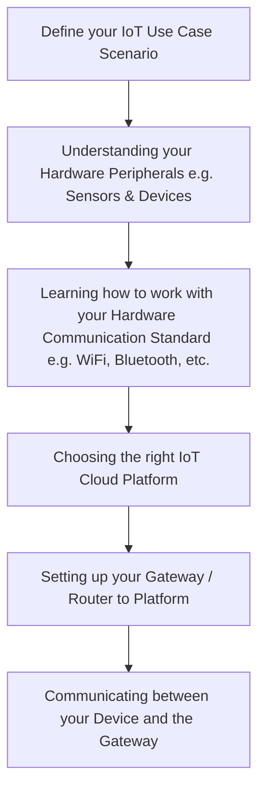

# SMB Innovation Summit 2019 Hackathon - Internet of Things
This build block takes a quick dive into the topic of Internet of Things (IoT). IoT is transforming the competitive landscape. As the world becomes increasingly connected, digitalization is a key differentiator that will enable companies to remain competitive. Using IoT data from billions of intelligent devices generating massive volumes of data, digitalization promises lower costs, improved production quality, flexibility, efficiency, shorter response time to market demands, and also opens up new business opportunities.

Prior to get your hands started, make sure you're provided with a Test & Development tenant of SAP Leonardo IoT 4.0 Service Cockpit and a Sensor Device.

Although it is **recommended** to use the sensor provided, you may consider to Bring your own Device (BYOD).

In this build block, you will learn & understand about the following components.

1. The SAP Leonardo IoT 4.0 Service provides a ready-to-consume API service that allows you to consume Sensor Device data immediately with the runtime of your choice.

2. The Texas Instruments CC2650STK sensor. This sensor is a Bluetooth Low Energy (BLE) Enabled Sensor Device which has 10 sensors including support for light, digital microphone, magnetic sensor, humidity, pressure, accelerometer, gyroscope, magnetometer, object temperature, and ambient temperature.

*You may consider to adopt the BYOD (Bring Your Own Device) Option B, although not recommended.*

Due to the limited time we have during the hackathon, we STRONGLY recommend you to go with the **Preconfigured Device Option A**.

## Overview
For this hackathon if you follow the **Option A - Preconfigured Device**, most of the components above have already been preconfigured and set up for you.

Your main task is then to understand **how to operate with the Device (Send / Receive Sensor Data) & Pull data from the IoT Platform**.

### Option A: Preconfigured Device
1. API Reference to GET Sensor Data from SAP Leonardo IoT Platform
2. Postman Samples on Reference to SAP Leonardo IoT API
2. Client-side: Sample SAP Fiori app to Retrieve Sensor Values deployed in Cloud Foundry
3. Server-side: Sample NodeJS app to Retrieve Sensor Values deployed in Cloud Foundry

### Option B: Bring Your Own Device (BYOD)
1. API Reference to create your device in the SAP Leonardo IoT Platform
2. Sample JavaScript language script processing the API Reference
3. Sample SAP Fiori App to Execute Sample Script

## Installation
Follow document  provided in the option folder. 

### Prerequisites
- [Personal] SAP Cloud Platform Trial Account
- [Instructor] SAP Leonardo IoT 4.0 Service Cockpit Account
- [Instructor] Texas Instruments SensorTag CC2650STK
- [Instructor] SAP Router App

## Usage
Follow document provided in the option folder. 

## Samples
To be updated

## Tutorials
https://github.com/SAP/iot-starterkit/tree/master/cf

## References
### Official Documentation
[SAP IoT](https://help.sap.com/viewer/product/SAP_CP_IOT_CF/Cloud/en-US) 
[REST gateway APIs for sending data to the IoT gateway](https://help.sap.com/viewer/d5f07bf9e1d646959a006f98d4cce321/Cloud/en-US)

### API References
[Internet of Things Service API Documentation](https://trial.canary.cp.iot.sap/iot/core/api/v1/doc/)

## Author
MARTINEZ GEA, Maria Trinidad
Tan, Jacob

## License
This repository is released under the terms of the MIT license.
See [LICENSE](https://github.com/B1SA/hackathon/blob/master/LICENSE) for more information or see https://opensource.org/licenses/MIT.
